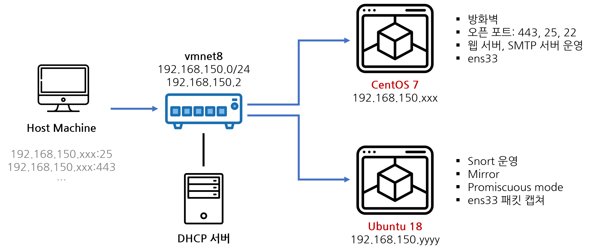
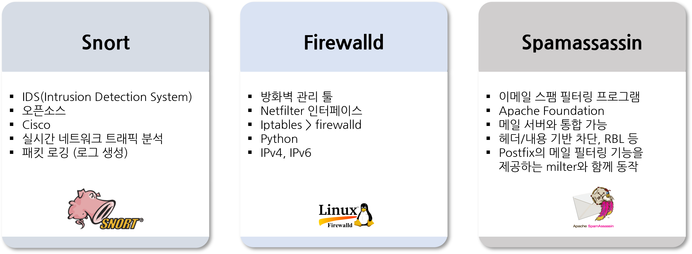
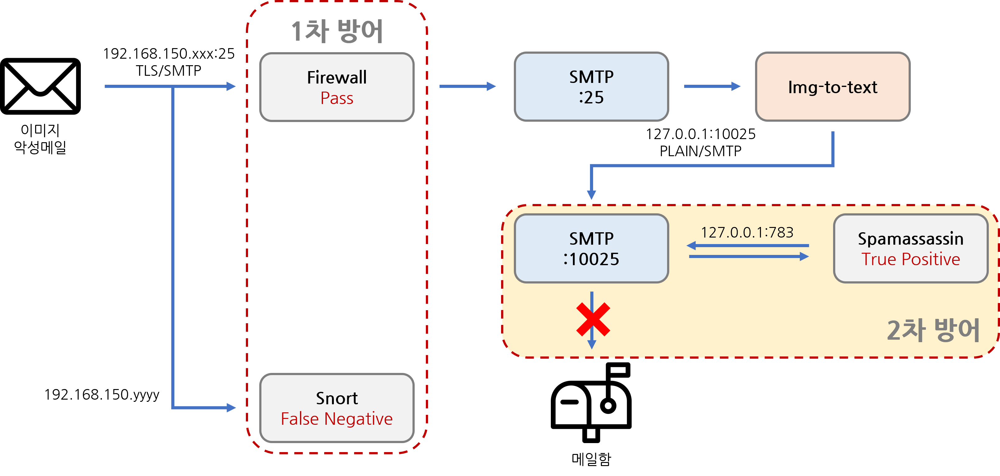

# Img-to-text
## About
- 설명 : 이미지 기반 피싱 메일 탐지 및 차단
- 언어 : Python3.8
- API : google-cloud-vision

## Architecture


## Network


## Service Flow


## Solutions



## Scenario


# Infrastructure Implementation
## Environments
```console
$ nmcil con add ifname ens33 type ethernet con-name nat ip4 192.168.150.xxx/24 gw4 192.168.150.2 ipv4.method manual ipv4.dns 8.8.8.8
# nmcli con up nat
# ping 8.8.8.8
>> PING 8.8.8.8 (8.8.8.8) 56(84) bytes of data.
64 bytes from 8.8.8.8: icmp_seq=1 ttl=128 time=41.0 ms
# hostnamectl set-hostname inyestar.com
# hostname inyestar.com
# vi /etc/hosts
127.0.0.1    localhost   localhost.localdomain   localhost4 localhost4.localdomain4  inyestar.com
# setenforce 0
# vi /etc/selinux/config
SELINUX=disabled
# firewall-cmd --permanent --add-service=smtp
# firewall-cmd --permanent --add-service=https
# firewall-cmd --reload
# yum -y install wget telnet cyrus-sasl-plain cyrus-sasl
# systemctl enable saslauthd
# systemctl start saslauthd
# mkdir /maildata
```

## Postfix
```console
# yum -y update postfix
# vi /etc/postfix/master.cf
# vi /etc/postfix/main.cf
# vi /etc/postfix/headercheck
# systemctl enable postfix; systemctl restart postfix
# telnet 127.0.0.1 10025
… 220 inyestar.com ESMTP
# postmulti -e init
# postmulti -I  postfix-ext -e create
# postmulti -i postfix-ext -e enable
# vi /etc/postfix-ext/master.cf
# vi /etc/postfix-ext/main.cf
# openssl req –x509 –nodes –newkey rsa:2048 –keyout inyestar.com.key –out inyestar.com.crt –nodes –days 365
# mkdir /etc/postfix-ext/ssl
# mv inyestar.com.key inyestar.com.crt /etc/postfix-ext/ssl
# systemctl enable postfix; systemctl restart postfix
# netstat -tnlp | grep /master
tcp   0   0 127.0.0.1:10025     0.0.0.0:*         LISTEN      1896/master
tcp   0   0 0.0.0.0:25          0.0.0.0:*         LISTEN      1969/master
# openssl s_client -connect 127.0.0.1:25 -starttls smtp
… 250 DSN
```